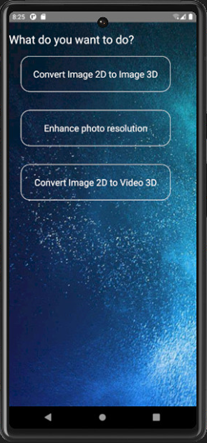
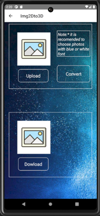
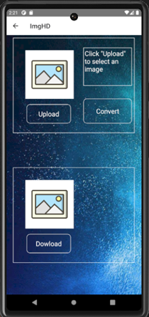
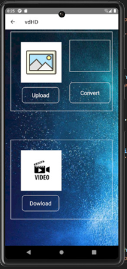
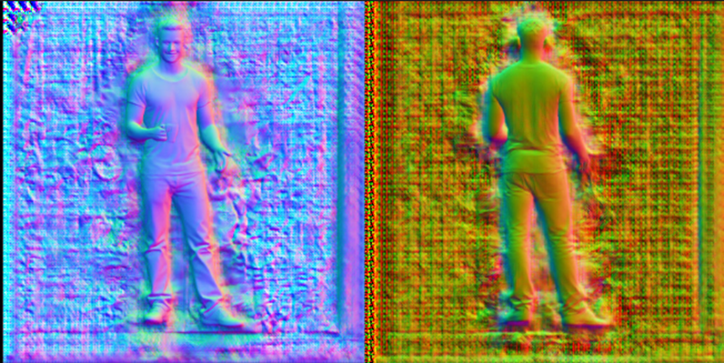
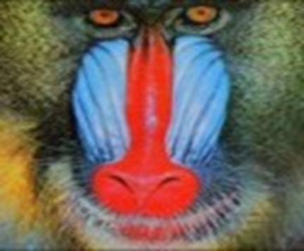

# Developing an Android Application for 2D to 3D Image Conversion and Resolution Enhancement using PyTorch and ESRGAN

## Introduction and Motivation
As a student conducting scientific research, I am exploring the rapidly developing field of deep learning and its applications in image processing. This project focuses on building an Android application that utilizes PyTorch for converting 2D images into 3D models and ESRGAN (Enhanced Super-Resolution GAN) for enhancing image resolution.

The ability to transform 2D images into 3D representations and improve image clarity is crucial in various domains, including virtual reality, gaming, and medical imaging. By integrating these advanced technologies into a mobile application, the goal is to make powerful image processing tools more accessible and efficient for users, thus contributing to the evolving landscape of digital media and visual content creation.

## Front-End
[App-2DTo3D FrontEnd](https://github.com/Thang2882002/App-2DTo3D--FrontEnd)

## Technologies
- **PyTorch**
- **ESRGAN**
- **React Native**
- **FastAPI**

## Requirements
- **FastAPI**
- **Python 3**
- [**PyTorch**](https://pytorch.org/) (tested on 1.4.0, 1.5.0)
- **json**
- **PIL**
- **skimage**
- **tqdm**
- **cv2**

### For Visualization
- [**trimesh**](https://trimsh.org/) with pyembree
- **PyOpenGL**
- **freeglut** (use `sudo apt-get install freeglut3-dev` for Ubuntu users)
- **ffmpeg**

> **Note:** At least 8GB GPU memory is recommended.

Run the following code to install all pip packages:
```sh
pip install -r requirements.txt 

```
## Demo
### Front-End
<div style="display: flex; justify-content: space-between;">     </div>

### Result
1. 2D to 3D

2. Enhance photo quality
<div style="display: flex; justify-content: space-between;">   </div>


These are the key sections of the application. Feel free to download and explore them for yourself. For any feedback or suggestions, please email me at: doanminhthang2808@gmail.com.